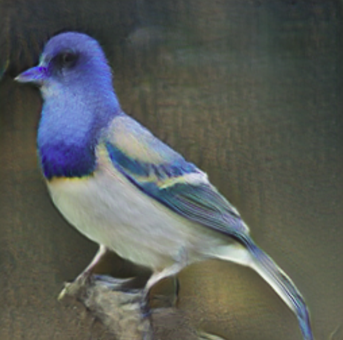
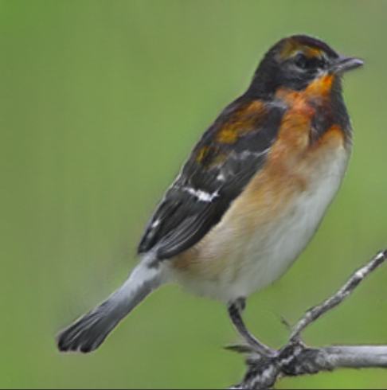
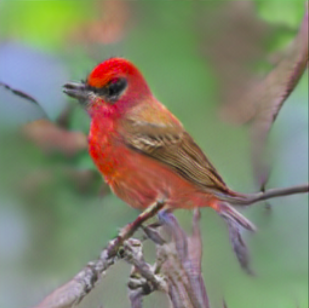

# Bangla Text to Image  Generation
Pytorch implementaion of Attentional Generative Adversial Network ([AttnGAN](http://openaccess.thecvf.com/content_cvpr_2018/papers/Xu_AttnGAN_Fine-Grained_Text_CVPR_2018_paper.pdf)) for Bengali Language

<b><i>Sample generated bengali text to image results</i></b>

| "রঙিন পাখি যার একটি নীল মাথা মুখ এবং  পেট সাদা এবং সাদা নীল পালক" | "ছোট পাখির একটি ছোট বিল কালো উইংবার সাদা বুক এবং একটি সোনার গলা রয়েছে" | "একটি ছোট পাখি যার উজ্জ্বল লাল মুকুট এবং পেট বাদামী ডানা এবং বাদামী গালের প্যাচ" |
|:--:|:--:|:--:|
 |  |  |

### Dependencies
python 3.6+

Pytorch 1.0+

In addition, please add the project folder to PYTHONPATH and `pip install` the following packages:
- `python-dateutil`
- `easydict`
- `pandas`
- `torchfile`
- `nltk`
- `scikit-image`

**Reference**

- [AttnGAN: Fine-Grained Text to Image Generation with Attentional Generative Adversarial Networks](https://arxiv.org/abs/1711.10485) [[code]](https://github.com/taoxugit/AttnGAN)
- [StackGAN++: Realistic Image Synthesis with Stacked Generative Adversarial Networks](https://arxiv.org/abs/1710.10916) [[code]](https://github.com/hanzhanggit/StackGAN-v2)
- [Unsupervised Representation Learning with Deep Convolutional Generative Adversarial Networks](https://arxiv.org/abs/1511.06434) [[code]](https://github.com/carpedm20/DCGAN-tensorflow)

### TODO:
- [ ] preprocessed meta data and dataset 
- [ ] Training 
- [ ] pretrained model
- [ ] valiadation
- [ ] Deploy as a web app that makes it easy to control the specific image one wants to generate
